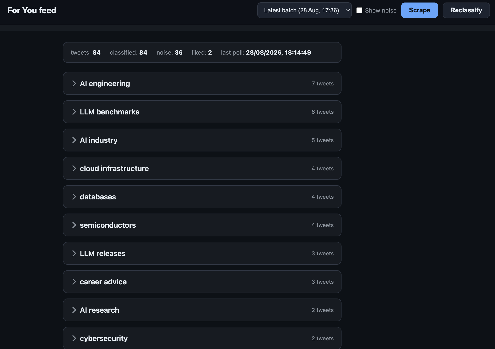
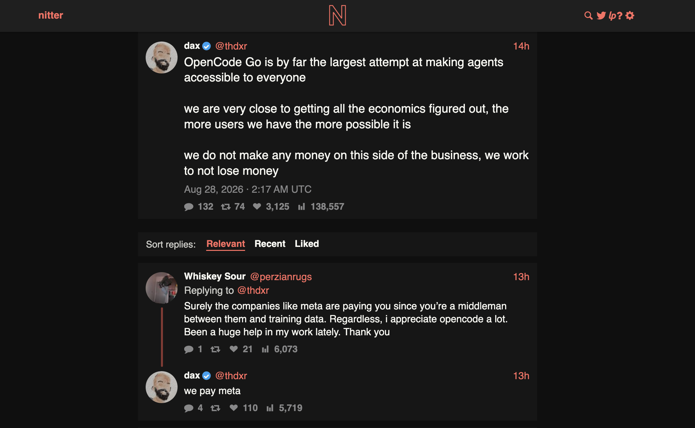

# x-nitter

A personal fork of [Nitter](https://github.com/zedeus/nitter). Plain Nitter is
a lightweight, read-only front-end for X (Twitter). This fork adds a personal,
logged-in feed dashboard on top: it fetches your **For You** timeline using
your own X account, keeps every tweet in a local database, and uses an LLM to
sort the feed into topics you define — so you can browse, search and like your
timeline without ads, algorithm noise or the official app. Nitter's front-end
(public profiles, tweet pages, RSS) still works exactly as before.

<p align="center">
  
  
</p>

## How it works

- **Feed dashboard** — a web UI served at `http://localhost:8080/xtime/` from
  the same server as Nitter. It shows your scraped For You feed grouped by
  topic, with a search/filter view.
- **Logged-in timeline scraping** — the feed is fetched in batches with your
  own X session through a small Python helper bundled with the project, which
  uses a browser-impersonating client so X treats it like a normal browser.
  Scrapes can be triggered from the dashboard UI, the API, or the terminal.
- **Local tweet store** — every batch is persisted to a local SQLite database,
  so browsing is instant and works offline.
- **LLM classification & translation** — tweets are classified into your
  configured topics and optionally translated, via any OpenAI-compatible API.
- **Interactions** — like/unlike tweets and follow/unfollow accounts directly
  from the dashboard.
- **Scrape API** — trigger scrapes and reclassification from the UI or curl.
- All upstream Nitter features remain: no-JS front-end, RSS, themes,
  lightweight pages.

## Cookies

Everything logged-in runs on your own X session, which means two cookies from
a browser where you are logged in to x.com: `auth_token` and `ct0`.

1. Log in to x.com in your browser.
2. Open DevTools → Application (Firefox: Storage) → Cookies → `https://x.com`.
3. Copy the values of `auth_token` and `ct0`.
4. Put them in a `.env` file in the repo root:

   ```
   AUTH_TOKEN=<auth_token value>
   CT0=<ct0 value>
   ```

5. Run the included session generator so Nitter's own API requests use the
   same cookies:

   ```bash
   node --env-file=.env make_sessions.mjs
   ```

   Re-run it whenever you refresh the cookies.

- Cookies expire periodically — if you see "Cookies are expired or invalid",
  re-export both values and re-run the generator.
- Treat these cookies like passwords: everything holding them (`.env`,
  session and cookie files) is gitignored and must never be committed.

## Feed configuration

The feed is configured in a JSON file (`xtime.config.json`, repo root,
gitignored):

- `topics` — the topic list the LLM sorts tweets into
- `providers` + `classify.provider` / `translate.provider` — an
  OpenAI-compatible endpoint: `model`, `baseUrl`, `apiKeyEnv` (name of an env
  var holding the API key, e.g. `OPENAI_API_KEY` set in `.env`), `timeoutMs`
- `translate.enabled` — turn translation on/off
- `pages`, `countPerPage`, `maxTopics`, `minPollIntervalSec`, `linkBase`

## Python setup

The feed backend needs one Python package (a maintained twikit fork
with browser impersonation). Create a virtualenv in the repo root:

```bash
python3 -m venv .venv
.venv/bin/pip install twifork
```

## Running

Once your cookies are in `.env`, Redis/Valkey is running and the Python setup
below is done, one command builds and starts the server:

```bash
nim c -d:ssl --threads:off -o:./xnitter src/nitter.nim && ./xnitter
```

Nitter listens on the address/port set in `nitter.conf` (default
`127.0.0.1:8080`); the feed dashboard is at `/xtime/`.

## Installation

- [Nim](https://nim-lang.org/install.html) to compile, Redis or Valkey for
  caching, Python 3 (with `venv`) and Node.js for the feed helper
- On Debian/Ubuntu also install `libpcre` and `libsass-dev`
- `cp nitter.example.conf nitter.conf` and adjust address/port

Based on [Nitter](https://github.com/zedeus/nitter) (AGPLv3).
